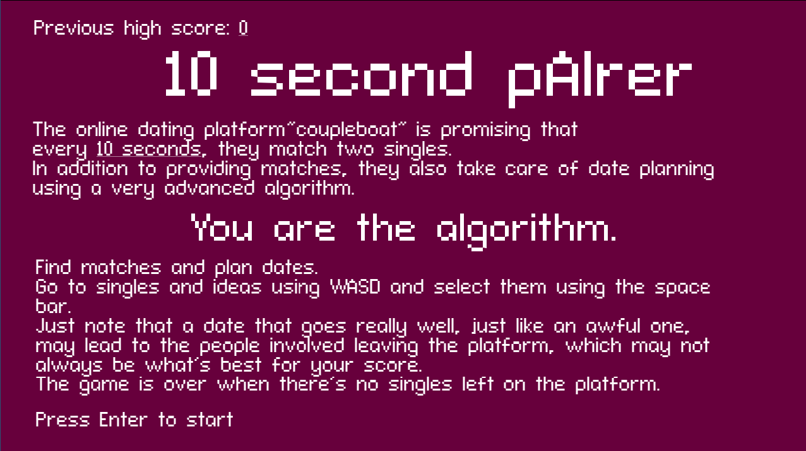
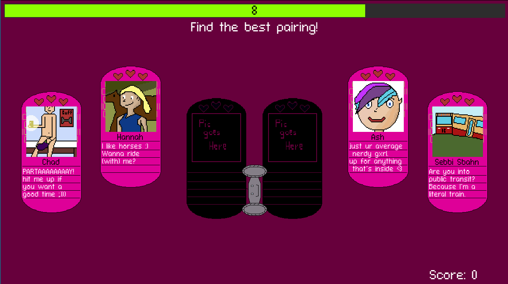
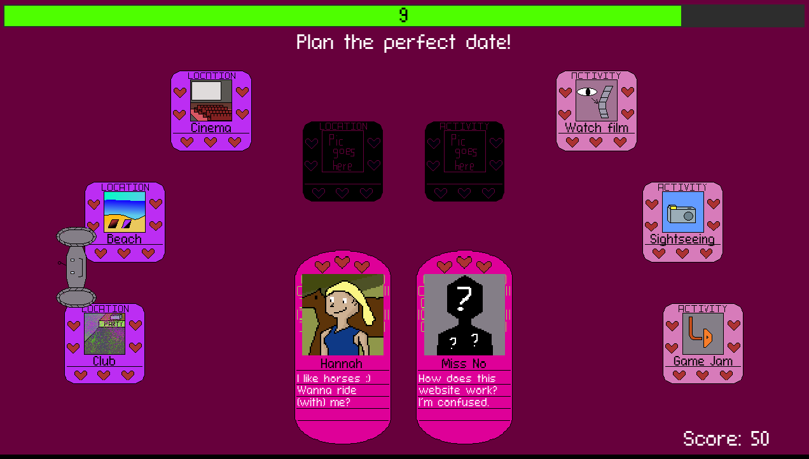
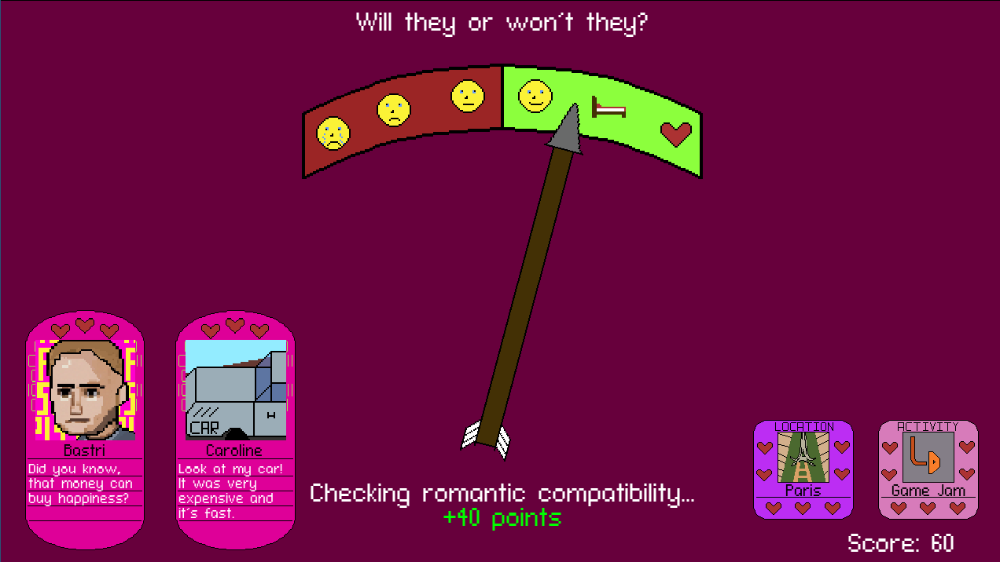

# ld51-10-second-pAIrer

## Description

Entry for the Ludum Dare 51 game jam.

You play as an algorithm tasked with matching singles and planning dates for them.

You have 10 seconds time to select two singles

Afterwards you have another 10 seconds to select a location and activity...

...for a simulated date, the outcome of which depends entirely on the combination of your choices.

## Software used

Engine - [Godot](https://godotengine.org/)  
Spriting - [Aseprite](https://www.aseprite.org/)  
Music - [Logic Pro](https://www.apple.com/logic-pro/)  
